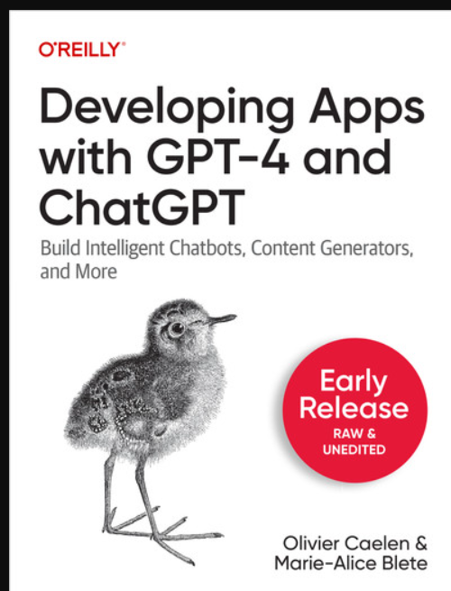

This repository contains different examples and usecases showcased in The book [Developing Apps with GPT-4 and ChatGPT](https://learning.oreilly.com/library/view/developing-apps-with/9781098152475/).
.

# Usage

### All examples
Install the requirements for all the examples with:

    pip install -r requirements.txt

Each example contains either a jupyter notebook, or a python file that can be run with:

    python [example_folder]/run.py

Some examples require some additional setup.

### Chap3_03_QuestionAnseringOnPDF
Start Redis with

    docker-compose up

### Chap3_04_VoiceAssistant
The gradio interface is available at the address displayed in the output.
